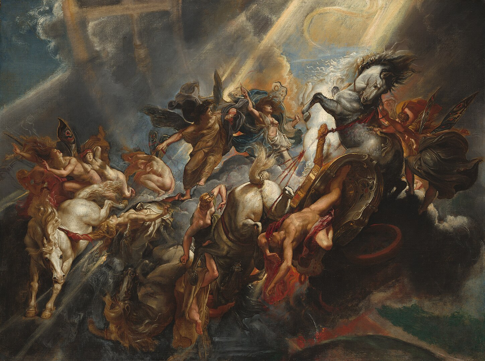

# ToC

- [Art](#art)
- [Material](#material)

# Art

## Peter Breugel the Elder

### The Hunters in the Snow

```art/hunters.jpg```

## Peter Paul Rubens

### The Fall of Phaeton

```art/phaeton.jpg```

### Sight

```art/sight.jpg```

### Taste

```art/taste.jpg```

### Smell

```art/smell.jpg```


## Moritz von Schwind

### Fairy Dance in the Alder Grove

```art/fairydance.jpg```

## Caravaggio

### Saint Jerome Writing

```art/saintgerome.jpg```

### The Lute Player

```art/lute.jpg```

### Cardsharps

```art/cardsharps.jpg```

## Jacques-Louis David

### The Death of Marat

```art/marat.jpg```

## Paul Jacques Aime Baudry

### Charlotte Corday

```art/charlotte.jpg```

## Nicolas Poussin

### Et in Arcadia ego

```art/arcadia.jpg```

## Claude Lorrain

### Villagers Dancing

```art/villagers.jpg```

### Roman Ideal Landscape with Cephalus, Procris, and Diana

```art/romanlandscape.jpg```

## Giorgone

### The Sleeping Venus

```art/venus.jpg```

# Material

### Waves

```material/waves.jpg```

### Boxes

```material/boxes.jpg```

### Dots

```material/dots.jpg```
